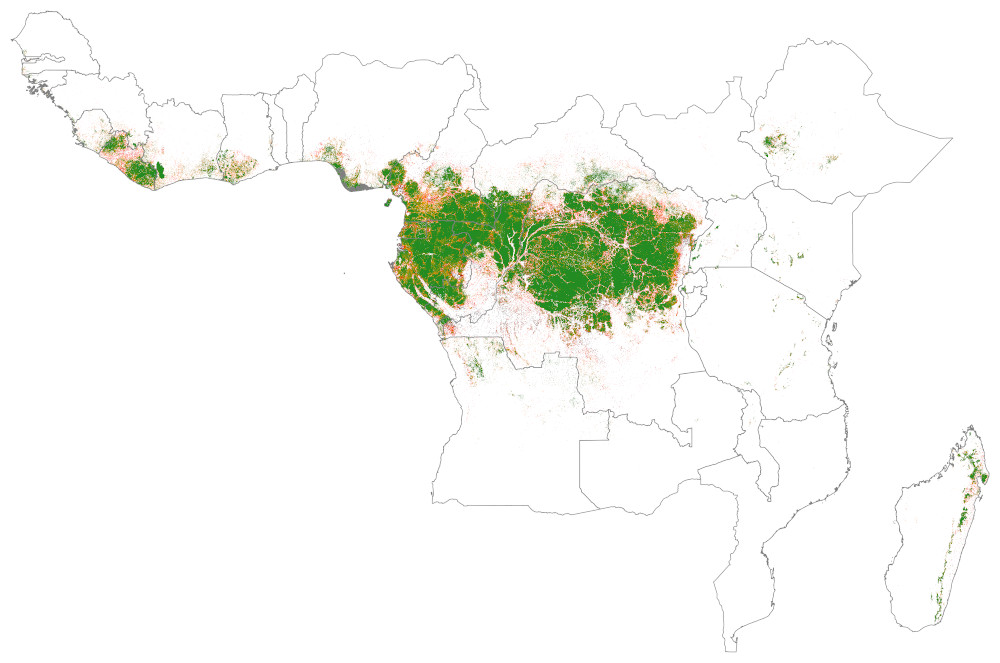

[](http://badge.fury.io/py/forestatrisk)
[](https://travis-ci.org/ghislainv/forestatrisk)

# `forestatrisk` Python package



## Estimating the risk of deforestation in tropical countries

`forestatrisk` is a Python package for estimating the spatial
probability of deforestation in the tropics depending on various
spatial environmental variables.

Spatial environmental variables can be derived from topography
(altitude, slope, and aspect), accessibility (distance to roads,
towns, and forest edge), deforestation history (distance to previous
deforestation) or landscape management (location inside a protected area)
for example.

### Sampling

Function `.sample()` allows the random sampling of observations points
considering historical deforestation maps. The sampling is balanced
and stratified considering remaining forest and deforested areas after
a given period of time. The function also retrieves information from
environmental variables for each sampled point. The sampling is done
by block to allow the computation on large study areas (e.g. country
or continental scale) with a high spatial resolution (e.g. 30m).

### Modelling

Function `.model_binomial_iCAR()` can be used to fit the deforestation
model from the data. A linear Binomial logistic regression model is
used to estimate the parameters of the deforestation model. The model
includes an intrinsic Conditional Autoregressive (iCAR) process to
account for the spatial autocorrelation of the observations
(Vieilledent et al. 2014). Parameter inference is done in a
hierarchical Bayesian framework. The function calls a Gibbs sampler
with a Metropolis algorithm written in pure C code to reduce
computation time.

### Predicting

Function `.predict()` allows predicting the deforestation probability
on the whole study area using the deforestation model fitted with the
`.model()` function. The prediction is done by block to allow the
computation on large study areas (e.g. country or continental scale)
with a high spatial resolution (e.g. 30m).

Function `.deforest()` predicts the future forest cover map based on a
raster of probability of deforestation (rescaled from 1 to 65535),
which is obtained from function `.predict()`, and an area (in
hectares) to be deforested.

## Tutorial

We wrote a tutorial using a notebook to show how to
use the `forestatrisk` Python package. We took Madagascar as a case
study considering past deforestation on the period 2000-2010,
estimating deforestation probability for the year 2010, and projecting
the future forest cover in 2050. The notebook is available at the
following web adress: https://forestatrisk.cirad.fr/tutorial

## Installation

You will need several dependencies to run the `forestatrisk` Python
package. The best way to install the package is to create a Python
virtual environment, either through `virtualenv` or `conda`.

### Using `virtualenv`

You first need to have the `virtualenv` package installed (see [here](https://packaging.python.org/guides/installing-using-pip-and-virtual-environments/)).

Then, create a virtual environment and install the `forestatrisk` package with the following commands:

```shell
cd ~
mkdir venvs # Directory for virtual environments
cd venvs
virtualenv --python=/usr/bin/python3 venv-far
source ~/venvs/venv-far/bin/activate
pip install numpy # Install numpy first
pip install forestatrisk # For PyPI version, this will install all other dependencies
pip install https://github.com/ghislainv/forestatrisk/archive/master.zip # For GitHub dev version
pip install statsmodels # Optional additional packages
```

To deactivate and delete the virtual environment:

```shell
deactivate
rm -R ~/venvs/venv-far # Just remove the repository
```

### Using `conda`

You first need to have `miniconda3` installed (see [here](https://docs.conda.io/en/latest/miniconda.html)).

Then, create a conda environment (details [here](https://docs.conda.io/projects/conda/en/latest/user-guide/tasks/manage-environments.html)) and install the `forestatrisk` package with the following commands:

```shell
conda create --name conda-far python gdal numpy matplotlib pandas patsy pip statsmodels --yes
conda activate conda-far
conda install -c conda-forge earthengine-api --yes
pip install pywdpa sklearn # Packages not available with conda
pip install forestatrisk # For PyPI version
# pip install https://github.com/ghislainv/forestatrisk/archive/master.zip # For GitHub dev version
```

To deactivate and delete the conda environment:

```shell
conda deactivate
conda env remove --name conda-far
```

## Figure

Map of the probability of deforestation in Madagascar for the year
2010 obtained with `forestatrisk`. Dark red: high probability of
deforestation, Dark green: low probability of deforestation.


